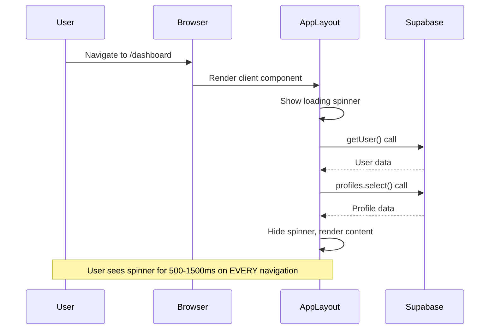
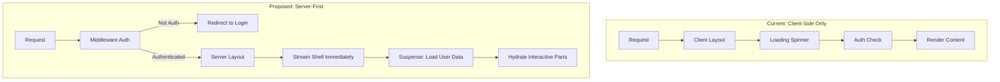

# Performance Overhaul Plan

## Executive Summary

After analyzing your codebase, I've identified several critical performance issues that explain the slowdowns. While previous optimization work addressed some concerns (lazy loading, data limits), the fundamental architecture still has bottlenecks.---

## Performance Diagnosis

### Current State Analysis

Based on code inspection, the app has these structural issues:| Issue | Severity | Impact ||-------|----------|--------|| Fully client-side app layout | CRITICAL | Blocks ALL rendering until auth resolves || No auth middleware | CRITICAL | Every navigation triggers client-side auth check || `playwright` in production deps | HIGH | ~50MB+ wasted in node_modules || Duplicate icon libraries | MEDIUM | `react-icons` + `lucide-react` = bundle bloat || 1800+ line GigEditorPanel | HIGH | Huge chunk even when lazy-loaded || 1000+ line Dashboard page | MEDIUM | Complex client component || Multiple fonts preloaded | MEDIUM | 5 fonts with 3 preloaded adds latency |

### Root Cause: Client-Side Auth Blocking

The primary bottleneck is in [`app/(app)/layout.tsx`](app/\\\\\\(app)/layout.tsx):



This pattern means:

1. Every route shows a loading spinner first
2. Two sequential API calls block rendering
3. No server-side rendering benefits
4. No streaming or progressive loading

---

## Proposed Fix Architecture



---

## Implementation Plan

### Phase 1: Critical Architecture Fixes (Highest Impact)

**1.1 Add Supabase Auth Middleware**Create [`middleware.ts`](middleware.ts) to handle auth at the edge:

- Check session before route renders
- Redirect unauthenticated users immediately
- No client-side auth check needed for route protection
- Uses Supabase's `@supabase/ssr` updateSession pattern

**1.2 Convert App Layout to Server-First**Refactor [`app/(app)/layout.tsx`](app/\\\\\\(app)/layout.tsx):

- Make the layout a Server Component
- Use a small Client boundary only for truly interactive parts (TopNav)
- Remove the blocking `useUser()` check from layout
- Let middleware handle auth protection

**1.3 Streamline UserProvider**Refactor [`lib/providers/user-provider.tsx`](lib/providers/user-provider.tsx):

- Parallelize the two API calls (getUser + profiles)
- Or combine into single RPC call on server
- Remove blocking behavior - render shell immediately

### Phase 2: Dependency Cleanup (Quick Wins)

**2.1 Move `playwright` to devDependencies**Currently in production dependencies - pure waste.**2.2 Remove `react-icons` package**The project uses `lucide-react` for icons. `react-icons` is massive (~3MB uncompressed) and appears unused.**2.3 Audit `googleapis` isolation**Verify it's truly server-only. Add explicit checks.

### Phase 3: Bundle Optimization

**3.1 Add Bundle Analyzer**Install and configure `@next/bundle-analyzer` to measure before/after.**3.2 Split GigEditorPanel**The 1800-line [`gig-editor-panel.tsx`](components/gigpack/editor/gig-editor-panel.tsx) should be:

- Split into separate tab components
- Each tab lazy-loaded independently
- Core form shell loads immediately

**3.3 Optimize Fonts**In [`lib/fonts.ts`](lib/fonts.ts):

- Reduce preloaded fonts from 3 to 1 (the primary UI font)
- Others load on-demand with `preload: false`
- Consider removing duplicate Zalando/Heebo that use same source file

### Phase 4: Rendering Improvements

**4.1 Add Route-Level Suspense Boundaries**Wrap data-fetching components in Suspense:

```tsx
// In page.tsx files
<Suspense fallback={<DashboardSkeleton />}>
  <DashboardContent />
</Suspense>
```

**4.2 Stream Non-Critical Content**Use React Server Components streaming for:

- Activity feeds
- Money summary
- Practice widgets

### Phase 5: Feature Diet System

**5.1 Create Feature Flags Infrastructure**Add a simple feature flag system:

- Environment-based flags (dev/staging/prod)
- User-based flags (for gradual rollout)
- Stored in a simple config file

**5.2 Identify Heavy Features to Gate**Candidates for feature flags:

- Full Calendar view (use lightweight date picker instead)
- Google Maps venue autocomplete
- Rich GigPack branding features (hero images, custom colors)
- Real-time activity feeds

---

## Measurement Plan

### Baseline Metrics (To Capture)

| Metric | How to Measure | Target ||--------|----------------|--------|| LCP | Lighthouse | < 2.5s || INP | Chrome DevTools | < 200ms || TTFB | Network tab | < 600ms || Initial JS Bundle | Build output | < 300KB gzipped || Time to Interactive | Performance trace | < 3s |

### Measurement Approach

1. Run production build: `npm run build`
2. Start production server: `npm run start`
3. Run Lighthouse on key pages: Dashboard, Gigs, Calendar
4. Capture Network waterfall for each page
5. Record bundle sizes from build output

---

## Risk Assessment

| Change | Risk | Mitigation ||--------|------|------------|| Add middleware | LOW | Non-breaking, additive || Refactor app layout | MEDIUM | Test auth flows thoroughly || Remove react-icons | LOW | Grep for usage first || Split GigEditorPanel | MEDIUM | Preserve all functionality || Feature flags | LOW | Non-breaking, additive |---

## Recommended Execution Order

1. **Measure baseline** - Capture current metrics
2. **Add middleware** - Quick win, no breaking changes
3. **Clean dependencies** - playwright, react-icons audit
4. **Add bundle analyzer** - Better visibility
5. **Refactor app layout** - Biggest impact
6. **Add Suspense boundaries** - Progressive enhancement
7. **Split large components** - GigEditorPanel
8. **Implement feature flags** - For heavy features
9. **Measure after** - Verify improvements

---

## Questions Before Proceeding